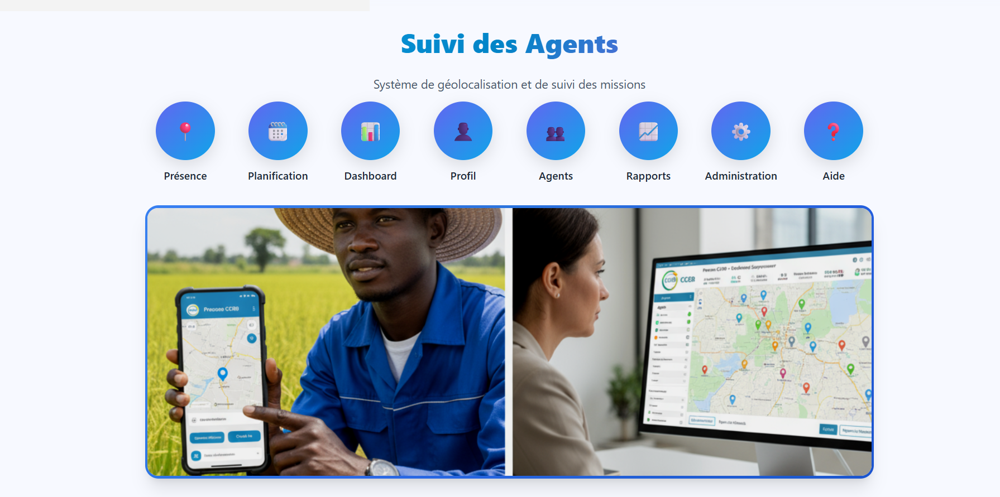
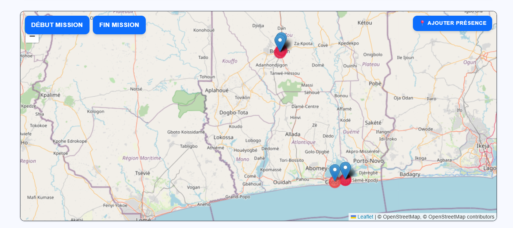
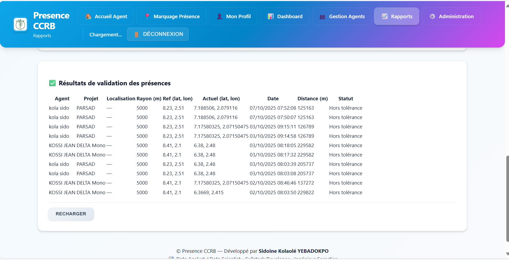

# 📍 Presence CCRB - Manuel d'Utilisation

## 🎯 Qu'est-ce que Presence CCRB ?

**Presence CCRB** est un système de suivi de présence des agents de terrain pour le **Conseil de Concertation des Riziculteurs du Bénin (CCRB)**. Il permet de vérifier que les agents se trouvent bien dans leurs zones d'intervention grâce à la géolocalisation GPS.



## 🚀 À quoi sert ce système ?

### Pour le CCRB
- **Vérifier la présence réelle** des agents sur le terrain
- **Générer des rapports fiables** avec preuves GPS
- **Suivre l'activité** des agents en temps réel
- **Exporter les données** pour les rapports officiels

### Pour les Agents
- **Marquer facilement** leur présence sur le terrain
- **Prendre des photos** comme preuve d'activité
- **Ajouter des notes** sur leurs observations
- **Consulter leur historique** de présence

## ✨ Nouvelles Fonctionnalités (Mise à jour récente)

### 💬 Messagerie Interne Complète
- **Conversations directes** entre agents, superviseurs et administrateurs
- **Liste de contacts** avec statut en ligne/hors ligne
- **Historique des messages** sauvegardé dans la base de données
- **Envoi de messages en temps réel** avec confirmation de livraison
- **Interface moderne** inspirée des applications de messagerie populaires
- **Recherche de contacts** pour trouver rapidement un collègue


### 🔐 Sécurité et Navigation
- **Navigation dynamique par rôle** : La barre de navigation s'adapte automatiquement au rôle de l'utilisateur (Agent, Superviseur, Admin)
- **Contrôle d'accès centralisé** : Protection de toutes les pages selon les permissions
- **Authentification JWT** : Tokens sécurisés pour toutes les requêtes API

### 📊 Tableau de Bord Amélioré
- **Données en temps réel** depuis la base de données Supabase
- **Statistiques personnalisées** par agent
- **Indicateurs de performance** dynamiques
- **Objectifs mensuels** avec suivi de progression

## 👥 Qui peut utiliser le système ?

### 🔹 Agents de Terrain
- Marquage de présence quotidien
- Prise de photos et notes
- Consultation de leur calendrier

### 🔹 Superviseurs
- Suivi des agents en temps réel
- Gestion des agents (création, modification)
- Génération de rapports

### 🔹 Administrateurs
- Accès complet au système
- Configuration des paramètres
- Gestion des unités administratives

## 📱 Comment accéder au système ?

### Sur Mobile (Recommandé pour les agents)
1. Ouvrez votre navigateur (Chrome, Firefox, Safari)
2. Allez à l'adresse : `https://presence-ccrb-v2.onrender.com`
3. L'application s'installe automatiquement comme une app

### Sur Ordinateur (Pour superviseurs et admins)
1. Ouvrez votre navigateur
2. Allez à l'adresse : `https://presence-ccrb-v2.onrender.com`
3. Utilisez l'interface web complète

## 🔧 Configuration Email (Nouveau)

**Problème résolu** : Les codes de vérification sont maintenant envoyés par email.

### Configuration requise
Pour que les emails de vérification fonctionnent, configurez ces variables d'environnement :

```env
EMAIL_USER=votre-email@gmail.com
EMAIL_PASS=votre-mot-de-passe-application-gmail
```

### Configuration Gmail
1. Activez la validation en 2 étapes sur votre compte Google
2. Générez un "App Password" dans les paramètres de sécurité
3. Utilisez ce mot de passe (16 caractères) dans `EMAIL_PASS`

📖 **Guide détaillé** : Voir [EMAIL_SETUP.md](EMAIL_SETUP.md)

## 🔐 Connexion au système

### Comptes par défaut

#### Compte de Test
Demander accès par email à **syebadokpo@gmail.com**
### Première connexion
1. Cliquez sur "Se connecter"
2. Entrez votre email et mot de passe
3. Cliquez sur "Connexion"
4. Vous arrivez sur votre tableau de bord

<!-- Illustration connexion volontairement supprimée pour rester à 3 screenshots clés -->

## 📋 Guide d'utilisation par rôle

### 👤 Pour les AGENTS

#### 1. Se connecter
- Utilisez vos identifiants fournis par votre superviseur
- L'application se souvient de votre connexion

#### 2. Communiquer avec l'équipe
- Allez dans **"Messages"** pour accéder à la messagerie
- **Sélectionnez un contact** dans la liste pour démarrer une conversation
- **Envoyez des messages** pour coordonner vos activités
- **Consultez l'historique** de vos conversations
- Recevez des **notifications** pour les nouveaux messages

#### 3. Choisir votre zone d'intervention
- **Département** : Sélectionnez votre département
- **Commune** : Choisissez votre commune
- **Arrondissement** : Sélectionnez l'arrondissement
- **Village** : Choisissez le village où vous travaillez

#### 4. Marquer votre présence

##### Début de journée
1. Cliquez sur **"Marquer présence (début)"**
2. L'application utilise votre GPS automatiquement
3. Ajoutez une photo si nécessaire
4. Écrivez une note sur vos activités prévues
5. Cliquez sur **"Confirmer"**

##### Pendant la journée (optionnel)
1. Cliquez sur **"Check-in"** pour marquer un point
2. Ajoutez une photo de votre activité
3. Notez vos observations
4. Cliquez sur **"Enregistrer"**

##### Fin de journée
1. Cliquez sur **"Quitter le terrain (fin)"**
2. L'application enregistre votre position finale
3. Ajoutez un résumé de votre journée
4. Cliquez sur **"Confirmer"**

#### 5. Consulter votre historique
- Allez dans **"Profil"** pour voir vos statistiques
- Consultez le **calendrier** pour voir vos jours de présence
- Vérifiez vos **missions** dans l'historique

<!-- Illustrations agents (calendrier/historique/profil) retirées pour rester concis -->

### 👨‍💼 Pour les SUPERVISEURS

#### 1. Accéder au tableau de bord
- Connectez-vous avec un compte superviseur
- Vous voyez la carte avec tous les agents



#### 2. Communiquer avec les agents
- Utilisez la **messagerie interne** pour contacter vos agents
- **Envoyez des instructions** ou demandez des rapports
- **Suivez les conversations** avec chaque agent
- **Coordonnez les activités** de terrain en temps réel

#### 3. Gérer les agents
- Allez dans **"Agents"**
- **Créer un agent** : Cliquez sur "Nouvel Agent"
- **Modifier un agent** : Cliquez sur l'icône crayon
- **Supprimer un agent** : Cliquez sur l'icône poubelle
- **Voir les détails** : Cliquez sur l'icône œil

<!-- Illustration planification retirée pour rester à 3 screenshots -->

#### 4. Suivre les agents en temps réel
- La **carte** montre les positions des agents
- Les **marqueurs colorés** indiquent les différents agents
- **Filtrez par date** pour voir l'historique

#### 5. Générer des rapports
- Allez dans **"Rapports"**
- Choisissez la **période** (aujourd'hui, cette semaine, ce mois)
- Sélectionnez un **agent** ou tous les agents
- Cliquez sur **"Générer le rapport"**
- **Exportez** en Excel ou PDF



### 👑 Pour les ADMINISTRATEURS

#### 1. Administration complète
- Accès à toutes les fonctionnalités superviseur
- **Messagerie avec tous les utilisateurs** (agents, superviseurs)
- Gestion des **unités administratives**
- Configuration des **paramètres système**

#### 2. Gestion des unités administratives
- Allez dans **"Administration"**
- Configurez les **départements, communes, arrondissements, villages**
- Définissez les **zones d'intervention** des agents

#### 3. Configuration système
- Paramètres de **tolérance GPS** (distance autorisée)
- Configuration des **notifications**
- Gestion des **sauvegardes**

## 🗺️ Comprendre la carte

### Marqueurs sur la carte
- 🟢 **Vert** : Agent présent et validé
- 🟠 **Orange** : Agent présent mais en dehors de la zone
- 🔴 **Rouge** : Agent absent ou problème de connexion
- 🔵 **Bleu** : Point de référence (village d'intervention)

### Légende des statuts
- **Présent** : Agent dans la zone autorisée (≤ 50km du village)
- **Hors zone** : Agent en dehors de la zone autorisée (> 50km)
- **Absent** : Aucun enregistrement de présence

## 📊 Comprendre les rapports

### Métriques principales
- **Total agents** : Nombre d'agents dans la période
- **Présents** : Agents qui ont marqué leur présence
- **Absents** : Agents sans enregistrement
- **Taux de présence** : Pourcentage de présence

### Types de rapports
- **Rapport quotidien** : Présence du jour
- **Rapport hebdomadaire** : Présence de la semaine
- **Rapport mensuel** : Présence du mois
- **Rapport par agent** : Historique d'un agent spécifique

## 🔧 Résolution des problèmes courants

### ❌ "Je ne peux pas me connecter"
**Solutions :**
1. Vérifiez votre email et mot de passe
2. Assurez-vous d'avoir une connexion internet
3. Contactez votre superviseur pour vérifier votre compte

### ❌ "Le GPS ne fonctionne pas"
**Solutions :**
1. Autorisez l'accès à la localisation dans votre navigateur
2. Vérifiez que le GPS est activé sur votre téléphone
3. Sortez à l'extérieur pour une meilleure réception

### ❌ "Je ne vois pas les agents sur la carte"
**Solutions :**
1. Vérifiez que vous êtes connecté avec un compte superviseur/admin
2. Actualisez la page (F5)
3. Vérifiez la période sélectionnée

### ❌ "L'application est lente"
**Solutions :**
1. Vérifiez votre connexion internet
2. Fermez les autres applications
3. Actualisez la page

## 📱 Installation sur mobile (PWA)

### Android
1. Ouvrez l'application dans Chrome
2. Appuyez sur le menu (3 points)
3. Sélectionnez "Ajouter à l'écran d'accueil"
4. L'icône apparaît sur votre écran d'accueil

### iPhone
1. Ouvrez l'application dans Safari
2. Appuyez sur le bouton de partage
3. Sélectionnez "Sur l'écran d'accueil"
4. L'icône apparaît sur votre écran d'accueil

## 🔒 Sécurité et confidentialité

### Protection des données
- Toutes les données sont **chiffrées** lors du transport
- Les mots de passe sont **sécurisés**
- Seuls les **superviseurs autorisés** peuvent voir vos données

### Respect de la vie privée
- Votre position n'est enregistrée que pendant vos **heures de travail**
- Vous pouvez **désactiver** le suivi à tout moment
- Vos données ne sont **jamais partagées** avec des tiers

## 📖 Guide d'utilisation détaillé

### 👉 [Consultez le guide complet d'utilisation](web/aide.html)

Une page d'aide complète est disponible dans l'application avec :
- 📍 Instructions pas à pas pour marquer votre présence
- 📱 Configuration GPS et précision requise
- 📊 Gestion des distances et limites tolérables
- ✅ Procédure de début et fin de mission
- 📅 Planification et évaluation des activités
- 🚫 Gestion des absences et permissions

### ⚠️ Points cruciaux à retenir

#### 1. Planification (WEEK-END uniquement)
- 📅 Planifiez vos activités **pendant le weekend**
- ❌ Vous ne pouvez pas planifier un jour déjà passé
- ✅ Vous planifiez toujours le **futur**

#### 2. GPS et Précision
- 📱 Installez **GPS Status** sur votre tablette
- 🎯 Précision requise : **2-10 mètres** (idéal)
- ❌ Précision > 100 m : Reconfigurer GPS Status
- 🔄 Refaire GPS Status si déplacement > 20-30 km

#### 3. Connexion Internet
- ✅ Nécessaire **uniquement** au début et à la fin de mission
- 🚫 Pas besoin de connexion permanente
- 📴 Vous pouvez éteindre/mettre en veille pendant la journée

#### 4. Procédure de présence

**Début de mission :**
1. Remplir : Département, Commune, Arrondissement, Village
2. Définir les heures de début et fin
3. Appuyer sur **"Début mission"**
4. Vérifier : **"Mission démarrée avec succès"** + coordonnées GPS
5. Calendrier passe au **vert** = Présence validée

**Fin de mission :**
1. Appuyer sur **"Finir position"**
2. Vérifier : **"Mission Complète"** (Completed)
3. Évaluer les activités dans **"Suivi activité"**

#### 5. Distances et Zones
- 📍 La présence est **JOURNALIÈRE**, pas par CEP
- 🔵 Un seul marquage par jour suffit
- 📍 Distance tolérable = 80% de la distance moyenne indiquée
- ✅ Vous restez "présent" dans tout votre rayon de couverture

#### 6. Absences et Permissions
- 📧 Avertir le superviseur ET le CCRB
- 📝 Obtenir une permission officielle écrite
- 📂 Conserver la permission pour justification mensuelle
- ❌ Sans permission = Absence non justifiée

## 📞 Support et assistance

### En cas de problème
1. **Consultez la page d'aide** dans l'application
2. **Contactez votre superviseur** direct
3. **Envoyez un message WhatsApp** (privilégié)
4. **Appelez si urgent** : +229 0196911346

### Contacts utiles
- **Développeur de l'application**
- **Titre** : Data Analyst | Web Developer Fullstack | MEAL Officer
- **Email** : syebadokpo@gmail.com
- **Email (Organisation)** : conseil.riziculteurs.benin2006@gmail.com
- **Téléphone** : +229 0196911346 / +229 0164052710
- **LinkedIn** : [LinkedIn](https://linkedin.com/in/sidoine-yebadokpo)
- **Organisation** : Conseil de Concertation des Riziculteurs du Bénin (CCRB)

## 🎉 Félicitations !

Vous maîtrisez maintenant le système Presence CCRB. Ce système vous permet de :

✅ **Travailler efficacement** sur le terrain  
✅ **Prouver votre présence** avec des données GPS  
✅ **Gagner du temps** avec des rapports automatiques  
✅ **Rester connecté** avec votre équipe  
✅ **Avoir une trace** de votre travail quotidien  

## 📚 Résumé rapide

### Pour les agents
1. **Connectez-vous** avec vos identifiants
2. **Choisissez votre zone** d'intervention
3. **Marquez votre présence** au début et à la fin
4. **Ajoutez des photos** et notes si nécessaire

### Pour les superviseurs
1. **Connectez-vous** avec un compte superviseur
2. **Gérez vos agents** dans la section Agents
3. **Suivez en temps réel** sur la carte
4. **Générez des rapports** selon vos besoins

### Pour les administrateurs
1. **Configurez le système** dans Administration
2. **Gérez les unités** administratives
3. **Supervisez** l'ensemble des opérations

---

**Bonne utilisation du système Presence CCRB !** 🚀

*Développé pour le Conseil de Concertation des Riziculteurs du Bénin (CCRB)*
